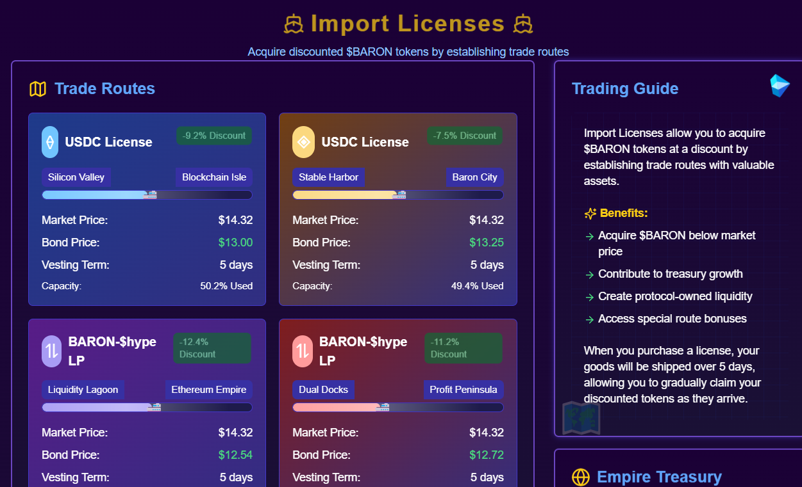

# 📜 Import License System(coming to v2)

## Overview

The Import License system enables acquiring $BARON at below-market rates through strategic bonding operations.

<figure><figcaption></figcaption></figure>

## Process Overview

1. Select bonding asset (USDC, $HYPE, LP tokens)
2. Review current discount rate (typically 5-15% below market)
3. Execute import license transaction
4. Receive vested $BARON over 5-day period
5. **Build positions at significant discounts**

## Supported Assets

* **USDC** - Primary stablecoin for import operations
* **$HYPE** - Hyperliquid native token
* **LP Tokens** - Liquidity provider positions _(coming soon)_

## Strategic Advantages

* Acquire $BARON below current market rates
* Contribute to protocol treasury diversification
* Build protocol-owned liquidity reserves
* Access special route bonuses and benefits
