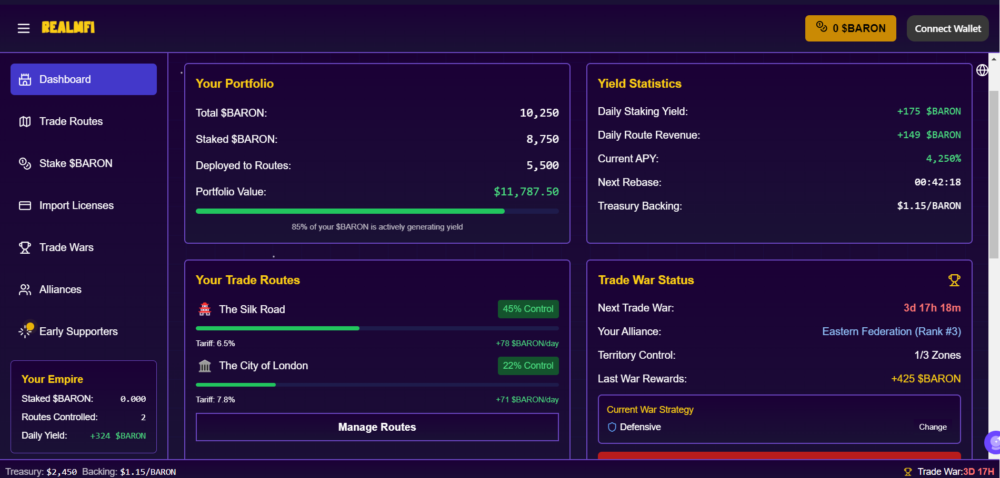
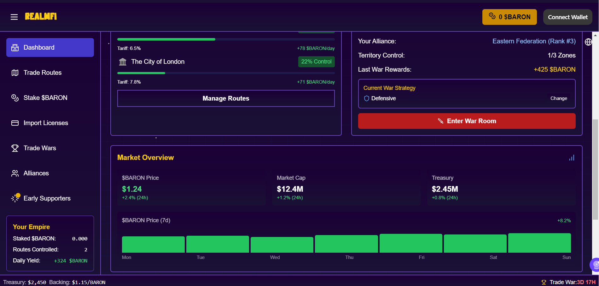
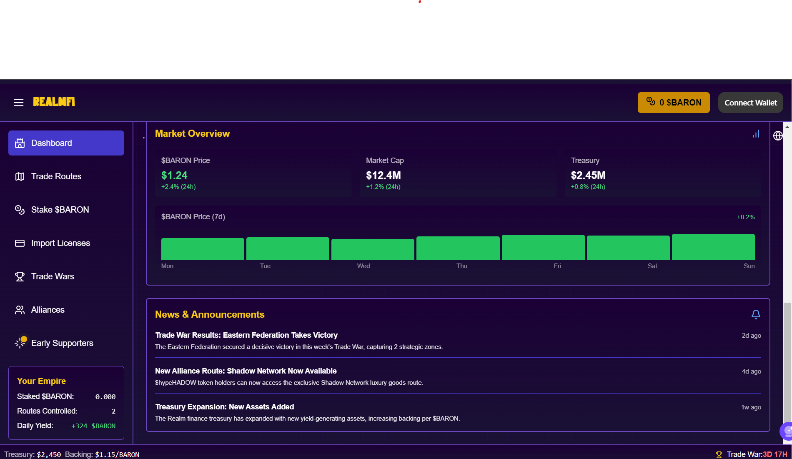

# 📊 Dashboard Overview

## Protocol Analytics

* **Treasury Status**: Total protocol-owned asset value
* **Market Metrics**: Current $BARON valuation and market cap
* **Backing Ratio**: Minimum guaranteed value per token
* **Current Yields**: Real-time APY for staking positions
* **News and announcements:** Real-time platform, users and community news and announcement

## Portfolio Management

* **Position Summary**: Staked holdings, route control, pending rewards
* **Territory Overview**: Visual representation of controlled trade routes
* **Performance Analytics**: Historical returns and trend analysis
* **Competitive Ranking**: Your position among all protocol participants

<figure><figcaption></figcaption></figure> <figure><figcaption></figcaption></figure> <figure><figcaption></figcaption></figure>

